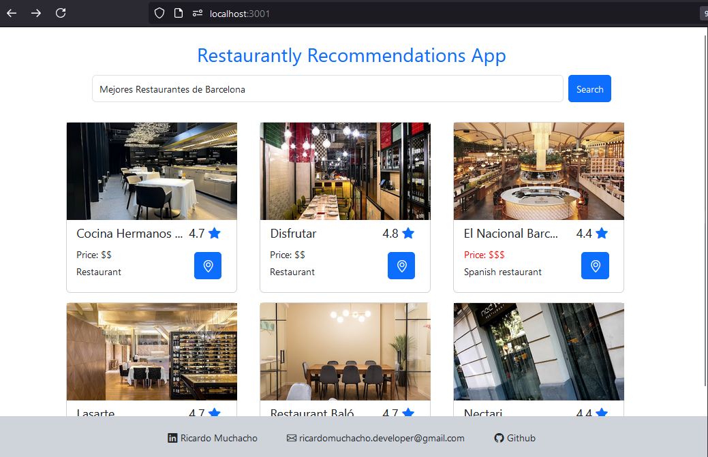

# Restaurant Recommendation Project

## Overview

This project is a curriculum project designed to practice React and TypeScript fundamentals, as well as SOLID principles. It utilizes the Google API to search for restaurant recommendations based on a text string input.

## Purpose

The primary purpose of this project is to:
- Practice and enhance skills in React and TypeScript.
- Implement and adhere to SOLID principles in software design.
- Practice responsive design accross different screen sizes.
- Gain experience in integrating third-party APIs, specifically the Google API.

## Features

- **Search Functionality**: Users can search for restaurant recommendations by entering a text string.
- **Google API Integration**: The project uses the Google API to fetch and display restaurant recommendations.
- **React and TypeScript**: The project is built using React for the frontend and TypeScript for type safety and better code quality.